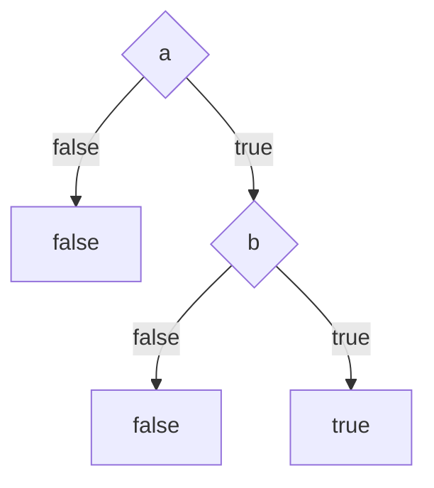

# Finding contradictions

Two requirements contradict each other when there is a state of the world in which both apply and
their required outcomes cannot both hold.

That sentence is the whole specification of the check. Everything below is about answering it
exactly, quickly, and without the tool ever hanging.

## The question, precisely

Each modelled requirement is a guard and an effect. The guard says when the requirement applies. The
effect says what it then requires.

```toml
[requirements.REQ-001]
when = "mitigation-enforced"      # the guard
then = "block_dynamic_code"       # the effect
```

Some pairs of effects are declared to be incompatible:

```toml
[effects]
block_dynamic_code = { conflicts_with = ["permit_dynamic_code"] }
```

So for every pair of requirements whose effects conflict, the tool asks:

> Is there an assignment of values to the terms that makes both guards true?

If yes, the two requirements contradict, and that assignment is the proof. If no, they never apply
at the same time and there is nothing to report.

## Why not just read them

Because the answer is not in the text.

The two requirements in the [worked example](../example.md) share no word. One guards on
`mitigation-enforced`, the other on `toolchain-building`. Reading either tells you nothing about the
other. The contradiction exists only in the states where both guards hold, and the number of states
grows multiplicatively with the number of terms.

Ten boolean terms give 1024 states. Twenty give a million. Add an enumeration with four values and a
bounded integer and the number stops being something a person checks.

## The naive method, and why it is still here

The obvious approach is to try every state. Enumerate all assignments, evaluate both guards, stop at
the first state where both are true.

This is correct and it is easy to get right. It is also exponential, so it is unusable as the primary
method.

It is nonetheless implemented, and it runs in the test suite against the fast method on generated
models. When two independent implementations of the same question agree on thousands of cases, a
mistake in the fast one has to be a mistake the slow one shares. That is a much stronger statement
than "the tests pass".

## Binary decision diagrams

A binary decision diagram is a way of representing a boolean function as a graph rather than as a
formula or a table. It was introduced by Randal Bryant in 1986 and it is the workhorse of hardware
verification, which is a field with the same problem: too many states to enumerate, and an answer
that has to be exact.

Start with a decision tree. Fix an order on the variables, then branch on each in turn. Here is
`a AND b`:



Then apply two reductions, repeatedly, until neither applies:

1. If a node's two edges lead to the same place, the node decides nothing. Delete it.
2. If two nodes are identical, keep one and point everything at it.

The second rule is where the compression comes from. Large boolean functions contain enormous
amounts of repeated structure, and a tree stores every copy while a graph stores one.

The result is called a reduced ordered binary decision diagram. It has a property that makes it
worth the trouble:

!!! info "Canonicity"

    For a fixed variable order, every boolean function has exactly one reduced ordered BDD.

    Two functions are equal if and only if their diagrams are the same graph. Equivalence checking,
    which is expensive on formulas, becomes pointer comparison.

### What this buys for our question

Satisfiability is nearly free. A reduced diagram is the constant `false` node if and only if the
function has no satisfying assignment. So "does a state exist where both guards hold" is answered by
building the diagram for `guard_A AND guard_B` and checking whether it is that one node.

Conjunction is a graph operation, not a search. Building the diagram does the work.

Extracting the witness is a walk. Follow any path from the root to the `true` node, recording the
branch taken at each variable. That path is a concrete state, which is exactly the
`mitigation-enforced = true, toolchain-building = true` in the report.

The answer is exact. This is not sampling, not a heuristic, and not a warning that something looks
suspicious. If the tool reports no conflict between two requirements, no state satisfying both
guards exists in the declared domains.

### The catch

BDD size depends heavily on the variable order, and a bad order can be exponentially larger than a
good one. For some functions every order is bad.

This is a real limitation, not a footnote. The next section is about refusing to be surprised by it.

## Handling terms that are not boolean

BDDs are boolean. Requirements are not written over booleans alone.

**Enumerations** become one boolean per value, with a constraint that exactly one is true. An
`operating-mode` with three values becomes three variables plus the rule that they are mutually
exclusive. The blocks are kept contiguous in the variable order, because splitting them is the
pathological case for diagram size.

**Bounded integers** are not expanded into one variable per value, which would be hopeless for a
range of ten thousand. Guards may only compare a term against a literal constant, so a term is only
ever distinguished at the constants its guards mention. A `queue-depth` compared against 1000 and
5000 has exactly four interesting regions, and one variable per region is enough.

This is why the guard language forbids comparing two terms against each other. That would need
arithmetic the representation does not have, and accepting it silently would be worse than refusing
it.

## Never hanging

A model checker that runs forever on a large model is not a gate. It is an outage, and the person it
blocks learns to skip it.

Three mechanisms keep the answer bounded.

### Decomposition

Requirements that cannot interact are checked separately. Two groups of ten variables are 2048
states between them. One group of twenty is a million.

Requirements are grouped when they share a guard term, and also when their effects conflict. The
second condition matters more than it looks: two requirements can guard on entirely different terms
and still contradict, because the state setting both guards true forces both effects. Grouping on
shared terms alone splits exactly the pair you were looking for, leaves both groups satisfiable, and
reports a pass. This project shipped that bug and now checks for it explicitly.

### A budget in states, not seconds

Every group's state space is the product of its domain sizes, so it is known by multiplication before
any search begins. If it exceeds the declared budget, the tool stops and says so.

The budget counts states, never wall clock time. A timeout would make the verdict depend on the
machine, so the same commit would pass on a workstation and fail in CI, and the conformance corpus
could not state an expected result at all.

The report names what to narrow:

```json
{
  "code": "MODEL_BUDGET_EXCEEDED",
  "detail": {
    "component": 3,
    "variables": 22,
    "states": 4194304,
    "budget": 1000000,
    "largest_contributors": [
      { "term": "queue-depth", "values": 8 },
      { "term": "operating-mode", "values": 3 }
    ]
  }
}
```

!!! warning "Do not raise the budget"

    The budget is a declared limit on what the project is willing to leave unchecked. Raising it to
    make a finding go away converts a known gap into an invisible one.

    The levers are narrowing the guards on the named terms, or splitting the group so fewer terms
    interact.

### An exceeded budget is a failure

A run that did not reach a verdict is not a passing run. Budget findings, skipped files, and narrowed
scope are all reported as work rather than folded into a pass. The tool is careful never to let
"we did not check" look like "there was nothing to find".

## Merging across specifications

Within one specification, the check catches requirements that disagree with each other. That is
useful and it is not where the money is, because one specification is small enough to review.

The merge takes the models from every specification, puts them in one constraint system, and asks
the same question across the whole set. This is the case that no review catches, because no review
reads twelve features at once.

Merging is only meaningful over more than one specification, so it happens when the scope is
`--all`. A specification that declares no model is reported as excluded from the merge rather than
quietly skipped, because a gap nobody can see is the failure this project exists to prevent.

## Classifying what it finds

A contradiction is not automatically a bug. Two requirements can genuinely pull in different
directions, and someone may have already decided which wins.

The tool uses the [intentions](grounding.md#intentions) layer to tell these apart:

| Verdict | Meaning | Severity |
| --- | --- | --- |
| Adjudicated | The goals have a unique winner under declared precedence | Advisory |
| Unadjudicated | The goals have no declared order; nobody has decided | Error |
| Defect | Both requirements serve the same goal, so no precedence can help | Error |
| Unclassified | One of the requirements declares no intention | Error |

The winner has to be a unique maximum, not merely a maximal element. If two goals both outrank a
third but not each other, nothing has been decided, and the tool says so rather than picking one.

## Why not an SMT solver

Z3 and its relatives are excellent, and they are the wrong tool here.

**The problem is finite and boolean.** After finitization there is no arithmetic beyond comparison
against constants, no quantifiers, and no uninterpreted functions. An SMT solver would spend its
generality on a fragment that does not need it.

**Determinism is a requirement, not a preference.** The conformance corpus states expected results as
data, and a second implementation is meant to be held to it exactly. A BDD is canonical: same model,
same diagram, same witness, on every machine and every run. Solver heuristics can change an answer's
shape between versions.

**The witness comes out naturally.** Extracting a satisfying assignment is a path walk, and the same
walk always returns the same one, because the tool takes the lowest index at each choice.

**It stays one binary.** `ears-sdd` is a single static executable with no runtime dependencies. A
native solver library would change that, and it would change it on the platform matrix where this
project has historically had its worst bugs.

The tradeoff is real. A future requirement for genuine arithmetic, or for comparing two terms
against each other, would be the point to revisit this. The guard language refuses those cases today
rather than pretending to handle them.

## Next

- [A contradiction, end to end](../example.md) if you have not seen the output yet.
- [Configuration](../reference/configuration.md) for the budget and the model file format.
